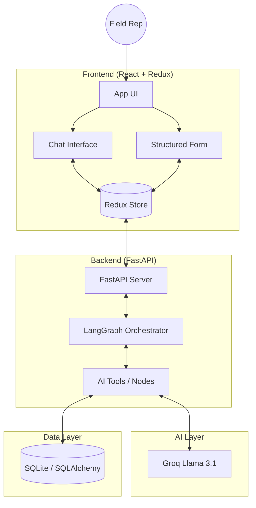

# 🧠 AI-First CRM — HCP Interaction Management System

<div align="center">


**An enterprise-grade CRM module for Healthcare Professional (HCP) interaction management. Built with an AI-native approach using LangGraph for stateful orchestration and Groq for high-performance LLM inference.**

[Key Features](#-key-features) • [System Architecture](#-system-architecture) • [AI Orchestration](#-agentic-workflow-langgraph) • [Tech Stack](#-tech-stack) • [Installation](#-getting-started) • [Database Schema](#-data-model)

</div>

---

## 📌 Project Overview

In the Life Sciences industry, field medical representatives spend significant time manually logging interactions with Healthcare Professionals (HCPs). Traditional CRM systems are often rigid, leading to poor data quality and administrative fatigue.

**AI-First CRM** transforms this workflow by providing a dual-mode interface:
1.  **Structured Form**: For high-precision, manual data entry.
2.  **Conversational AI**: A natural language interface that understands context, extracts complex entities, and updates CRM state in real-time.

This project demonstrates how to build a robust, agentic system that bridges the gap between unstructured field conversations and structured enterprise data.

---

## 🚀 Key Features

### 1. Agentic Data Extraction (`log_tool`)
Automatically parses unstructured meeting notes into a precise CRM schema.
- **Entity Recognition**: Distinguishes between HCP names, attendees, and therapeutic topics.
- **Smart Classification**: Differentiates between **Materials** (brochures, PDFs) and **Samples** (physical product units).
- **Outcome Analysis**: Captures the full meaning of agreements and commitments.
- **Follow-up Intelligence**: Extracts specific action items and timelines.

### 2. Conversational Form Editing (`edit_tool`)
Modify existing CRM records using natural language.
- *Example*: "Change the HCP name to Dr. Jenkins and add 'Pricing Brochure' to materials."
- The AI identifies only the fields that need updating, maintaining data integrity for unchanged fields.

### 3. Context-Aware History Retrieval (`history_tool`)
Instantly retrieve a professional's entire interaction timeline.
- Semantic search allows reps to find history even if the name is slightly misspelled or only partially provided.

### 4. Predictive Follow-ups & Summarization (`suggest` & `summary`)
- **Suggest**: Generates 3 intelligent next steps based on the current interaction context.
- **Summary**: Produces concise, 2-3 sentence executive summaries for quick managerial review.

---

## 🏗️ System Architecture

The application follows a modern decoupled architecture designed for scale and AI integration.



---

## 🤖 Agentic Workflow (LangGraph)

The core intelligence is managed by a **Stateful Graph** that routes user intent to specialized AI tools.

| Component | Responsibility |
| :--- | :--- |
| **State Management** | Maintains user input, interaction context, and agent output throughout the lifecycle. |
| **Dynamic Router** | Uses keyword and semantic analysis to route requests to the appropriate specialized node. |
| **Tool Nodes** | Independent execution units (`Log`, `Edit`, `History`, etc.) that interact with the LLM and Database. |
| **Conditional Edges** | Logic gates that ensure the system only performs requested actions and handles errors gracefully. |

---

## 🛠️ Tech Stack

### Frontend
- **React 19**: Modern UI component architecture.
- **Redux Toolkit**: Centralized state management for real-time form-chat synchronization.
- **CSS3**: Custom-designed, mobile-responsive enterprise interface.
- **Axios**: Robust HTTP client for backend communication.

### Backend
- **FastAPI**: High-performance Python framework for low-latency AI responses.
- **LangGraph**: Framework for building stateful, multi-agent systems.
- **SQLAlchemy**: ORM for structured data persistence.
- **Uvicorn**: Lightning-fast ASGI server.

### AI & Infrastructure
- **Groq Cloud**: Hosted inference using **Llama 3.1-8b-instant** for sub-second processing.
- **SQLite**: Local relational database for rapid development and portability.
- **Python Dotenv**: Secure environment variable management.

---

## 📂 Project Structure

```bash
ai-crm-hcp-project/
├── backend/
│   ├── app/
│   │   ├── agent/             # AI Orchestration Logic
│   │   │   ├── graph.py       # LangGraph definition
│   │   │   └── tools.py       # AI tools (Log, Edit, etc.)
│   │   ├── db/                # Database Layer
│   │   │   ├── database.py    # Connection & Session
│   │   │   └── models.py      # SQLAlchemy Schema
│   │   └── main.py            # FastAPI Entry Point
│   ├── .env                   # Configuration
│   └── requirements.txt       # Python Dependencies
├── frontend/
│   ├── src/
│   │   ├── components/        # UI Components (Form)
│   │   ├── redux/             # Global State
│   │   ├── App.js             # Main Application Logic
│   │   ├── ChatBox.js         # Conversational Interface
│   │   └── api.js             # Service Layer
│   └── package.json           # Node Dependencies
└── docs/                      # Documentation Assets
```

---

## ⚙️ Getting Started

### 1. Prerequisites
- Python 3.9+
- Node.js 18+
- Groq API Key ([Get one here](https://console.groq.com/))

### 2. Backend Installation
```bash
cd backend
python -m venv venv
# Windows: .\venv\Scripts\activate | Unix: source venv/bin/activate
pip install -r requirements.txt
```

Create a `.env` file in `backend/`:
```env
GROQ_API_KEY=your_api_key_here
```

### 3. Frontend Installation
```bash
cd frontend
npm install
```

### 4. Running the Application
**Start Backend:**
```bash
# From backend directory
uvicorn app.main:app --reload
```

**Start Frontend:**
```bash
# From frontend directory
npm start
```

---

| Before             | After                |
| ------------------ | -------------------- |
| Plain text dump    | Structured section   |
| No formatting      | Tables + headings    |
| Weak explanation   | Strong justification |
| No clarity of work | Clear contribution   |
| Not professional   | Recruiter-ready      |


## 🛡️ Security & Scalability
- **Sanitized Extraction**: LLM prompts are designed to return strict JSON, preventing data corruption.
- **State Isolation**: Each interaction is handled in an isolated graph state to prevent data leakage.
- **CORS Management**: Backend is configured with strict origin controls for secure web communication.

---

## 👩‍💻 Author
**Varshitha Andra**  

---

<div align="center">

⭐ **If you find this project useful, please star the repository!**

</div>
